# VSD Internship — VLSI System Design

> A hands-on internship journey through VLSI design, RISC-V toolchains, and digital systems.

---

## Table of Contents

| # | Task | Description |
|---|------|-------------|
| 1 | [Task 1](#task-1-risc-v-toolchain-setup--c-compilation) | Compile C code using GCC and the RISC-V GNU Toolchain |
| 2 | [Task 2](#task-2-spike-simulation-of-the-compiled-c-code) | Spike simulation of RISC-V assembly code and observation |
| 3 | [Task 3](#task-3-risc-v-reference-design-bring-up) | Use the VSD Codespace to run a pre-built RISC-V + FPGA environment and replicate the toolchain locally |
| 4 | [Task 4](#task-4-gpio32-ip-design-integration--simulation) | Design a 32-bit memory-mapped GPIO register IP, integrate it into the basicRISCV SoC, and verify with Icarus Verilog simulation |
| 5 | [Task 5](#task-5-design-a-multi-register-gpio-ip-with-software-control) | Extend the simple GPIO IP into a multi-register GPIO peripheral with software-controlled direction and input/output modes |
| 6 | [Task 6](#task-6-programmable-countdown-timer-ip) | Design and integrate a programmable countdown timer IP with one-shot, periodic, and prescaler modes into the basicRISCV SoC |
| 7 | [Task 7](#task-7-commercial-grade-ip-documentation--release) | Package the Timer IP with commercial-grade documentation — user guide, register map, integration guide, and copy-paste C examples |

---

## Task 1: RISC-V Toolchain Setup & C Compilation

**Objective:** Install the RISC-V GNU cross-compiler toolchain and compile a C program for both the native host (x86-64) and the RISC-V target architecture. Observe the differences in assembly output between optimization levels.

---

### Step 1 — Install Dependencies

Install the required packages for building the cross-compiler on a Fedora/RHEL-based system:

```bash
sudo dnf install autoconf automake python3 libmpc-devel mpfr-devel gmp-devel \
  gawk bison flex texinfo patchutils gcc gcc-c++ zlib-devel expat-devel \
  libslirp-devel ncurses-devel
```

---

### Step 2 — Build the Linux Cross-Compiler

Choose an install prefix (a writable directory). Here, `~/riscv` is used:

```bash
./configure --prefix=~/riscv
make linux
echo 'export PATH=$PATH:~/riscv/bin' >> ~/.bashrc
source ~/.bashrc
```

> Note: This step takes a while — grab a coffee while it compiles!

---

### Step 3 — Verify the Installation

List the installed binaries:

```bash
cd ~/riscv/bin
ls
```

You should see a set of `riscv64-unknown-linux-gnu-*` tools:

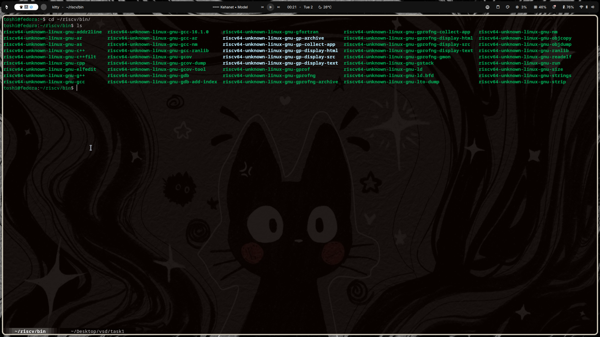

Confirm the cross-compiler version:

```bash
riscv64-unknown-linux-gnu-gcc --version
```

**Expected output:**
```
riscv64-unknown-linux-gnu-gcc (GCC) 14.1.0
Copyright (C) 2024 Free Software Foundation, Inc.
This is free software; see the source for copying conditions.  There is NO
warranty; not even for MERCHANTABILITY or FITNESS FOR A PARTICULAR PURPOSE.
```

Also confirm the native GCC is available:

```bash
gcc -v
```

---

### Step 4 — Write the C Program

Create a file `sum1ton.c` — a simple program that computes the sum from 1 to *n*:

```c
#include <stdio.h>

int main()
{
    int i, sum = 0, n = 100;

    for (i = 1; i <= n; ++i)
    {
        sum += i;
    }

    printf("Sum of numbers from 1 to %d is %d\n", n, sum);
    return 0;
}
```

---

### Step 5 — Compile and Run on the Host (GCC)

Compile for the native host architecture and run:

```bash
gcc sum1ton.c -o sum1ton
./sum1ton
```

**Output:**
```
Sum of numbers from 1 to 100 is 5050
```

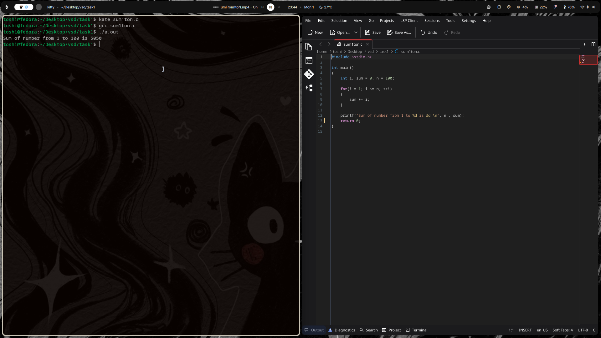

---

### Step 6 — Cross-Compile for RISC-V & Inspect Assembly

#### With `-O1` optimization:

```bash
riscv64-unknown-linux-gnu-gcc -O1 -mabi=lp64d -march=rv64g -o sum1ton.o sum1ton.c
riscv64-unknown-linux-gnu-objdump -d sum1ton.o | less
```

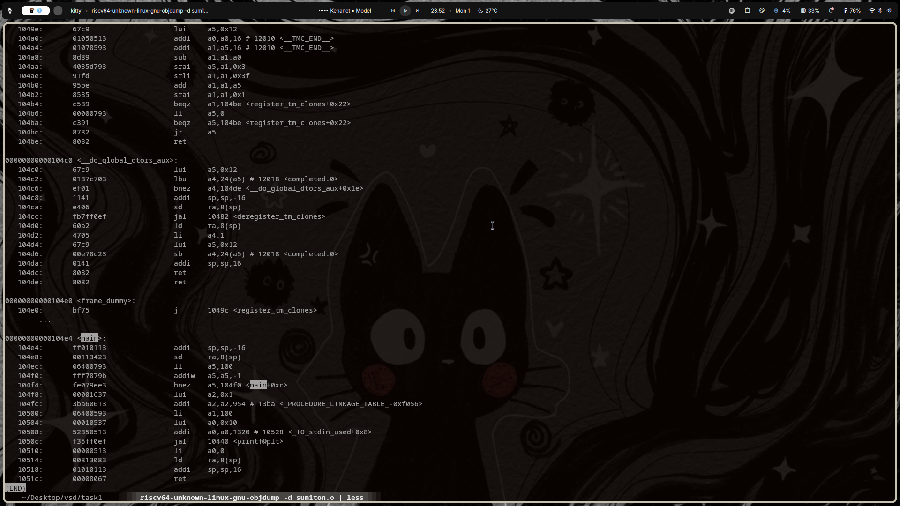

#### With `-Ofast` optimization:

```bash
riscv64-unknown-linux-gnu-gcc -Ofast -mabi=lp64d -march=rv64g -o sum1ton.o sum1ton.c
riscv64-unknown-linux-gnu-objdump -d sum1ton.o | less
```

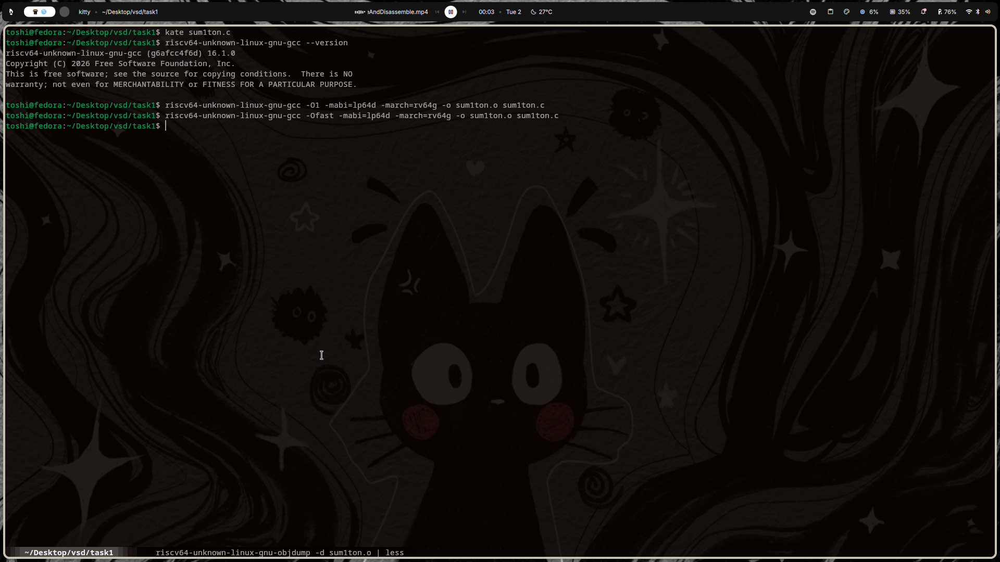
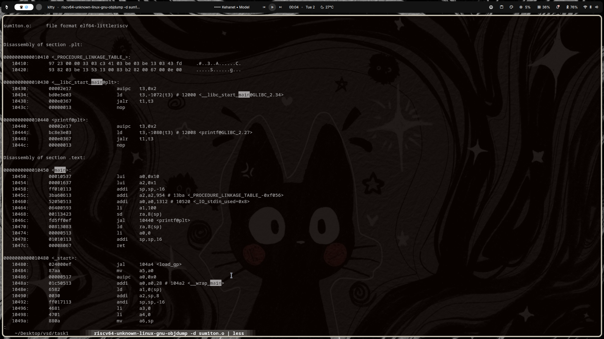

> **Key Observation:** With `-Ofast`, the compiler aggressively optimizes the loop — notice the significantly fewer instructions compared to `-O1`. The compiler may even evaluate the sum at compile time or use vectorization.

---

## Task 2: Spike Simulation of the compiled C code

> This task is split into two parts. **Part A** uses the `sum1ton` program from Task 1. **Part B** introduces a new Fibonacci series program and repeats the same compilation and simulation workflow.

**Objective:** Simulate the C code compiled using RISC-V GNU Toolchain using Spike, a RISC-V simulator, and observe the output. Along with that, also use debug tools in spike. 

---

### Step 1 — Install dependencies and Spike

First, install all dependencies : 
```bash
sudo dnf install -y gcc-c++ make dtc libmpc-devel mpfr-devel gmp-devel
```
Next, clone the github repository of Spike: 
```bash
git clone https://github.com/riscv-software-src/riscv-isa-sim.git
cd riscv-isa-sim
```
Now, build and install Spike: 
```bash
mkdir build
cd build
../configure --host=riscv64-unknown-linux-gnu --prefix=/usr/local
make -j$(nproc)
sudo make install
```
Verify installation of Spike:

```bash
spike --help
```

A help menu should open if you have installed it correctly.

---

### Step 2 — Install RISC-V proxy kernel

```bash
cd ~
git clone https://github.com/riscv-software-src/riscv-pk.git
cd riscv-pk
mkdir build
cd build
../configure --host=riscv64-unknown-linux-gnu --prefix=/usr/local
make -j$(nproc)
sudo make install
```
Set a symlink to pk so we do not have to type an absolute path every single time.
```bash
sudo ln -s /usr/local/riscv64-unknown-linux-gnu/bin/pk /usr/local/bin/pk
```

---

### Step 3 — Compiling the program using gcc and RISC-V toolchain

**Using GCC:**

```bash
gcc sum1ton.c
./a.out
```

**Expected output:**
```
Sum of numbers from 1 to 100 is 5050
```
**Using RISC-V GNU Toolchain:**

```bash
riscv64-unknown-linux-gnu-gcc -march=rv64g -mabi=lp64d -static -o sum1ton.o sum1ton.c
spike $(which pk) sum1ton.o
```
Observe that the outputs will be same for both GCC and RISC-V toolchain.
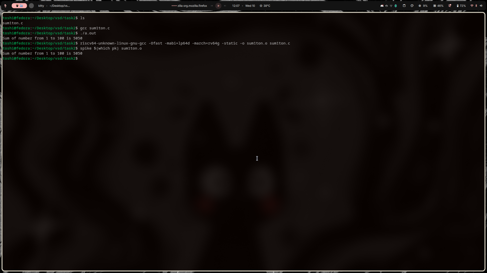

---

### Step 4 — Using the debugger in Spike

To debug a program using spike, first we need to look at the object dump of the program.
```bash
riscv64-unknown-linux-gnu-objdump -d sum1ton.o | less
```
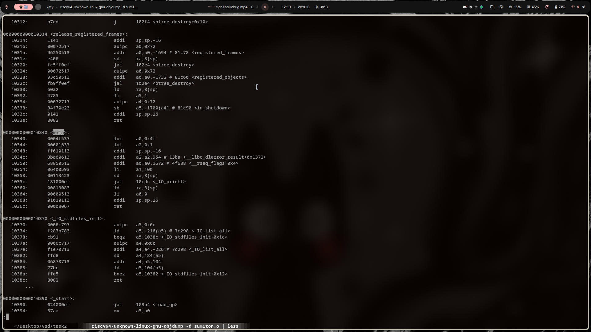
Now, use spike debugger to debug the program.
```bash
spike -d $(which pk) sum1ton.o
```
If we look at the object dump of the program, main function starts at address 10340. So when we start debug, we run the program counter until that address and then we look at individual registers to find out a bug if there is any.
```
0000000000010340 <main>:
   10340:       0004f537                lui     a0,0x4f
   10344:       00001637                lui     a2,0x1
   10348:       ff010113                addi    sp,sp,-16
   1034c:       3ba60613                addi    a2,a2,954 # 13ba <__libc_dlerror_result+0x1372>
   10350:       68850513                addi    a0,a0,1672 # 4f688 <__rseq_flags+0x4>
   10354:       06400593                li      a1,100
   10358:       00113423                sd      ra,8(sp)
   1035c:       181000ef                jal     10cdc <_IO_printf>
   10360:       00813083                ld      ra,8(sp)
   10364:       00000513                li      a0,0
   10368:       01010113                addi    sp,sp,16
   1036c:       00008067                ret
```
In the image, we can see that I ran the Program counter from 0 to 10340. Then checked a0. The reg value has not been updated yet. To move forward you press enter and on each step after the PC ticks, we can check and see how the register values are changing. 
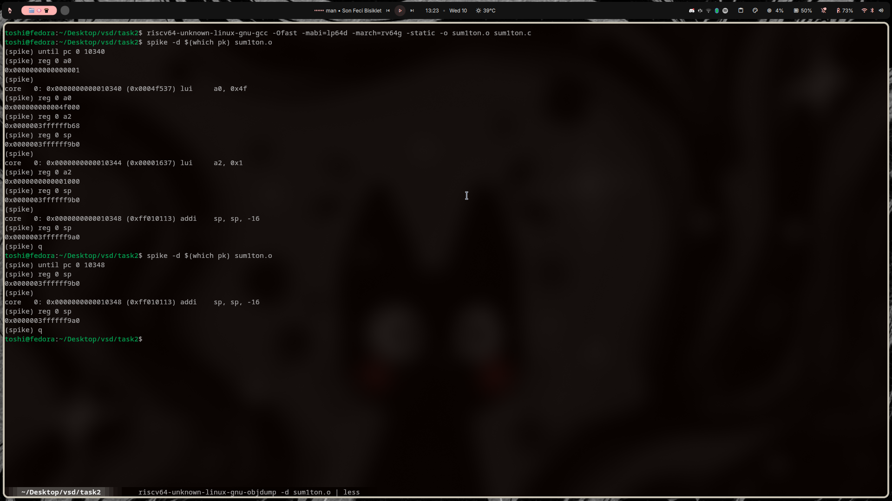


---

## Task 2 — Part B: Fibonacci Series

**Objective:** Repeat the Spike simulation workflow with a new C program that generates the Fibonacci series. Observe that both GCC (host) and the RISC-V toolchain produce identical output, and use the Spike debugger to step through the compiled binary.

---

### Step 1 — Write the C Program

Create a file `fibonacci.c`:

```c
#include <stdio.h>

int main() {

    int n = 10, first = 0, second = 1, next;

    printf("Fibonacci Series: ");

    for (int i = 0; i < n; i++)
    {
        if (i <= 1)
            next = i;
        else
        {
            next = first + second;
            first = second;
            second = next;
        }

        printf("%d ", next);
    }
    printf("\n");
}
```

---

### Step 2 — Compile and Run (GCC & RISC-V Toolchain)

**Using GCC:**

```bash
gcc fibonacci.c
./a.out
```

**Expected output:**
```
Fibonacci Series: 0 1 1 2 3 5 8 13 21 34
```

**Using RISC-V GNU Toolchain:**

```bash
riscv64-unknown-linux-gnu-gcc -march=rv64g -mabi=lp64d -static -o fibonacci.o fibonacci.c
spike $(which pk) fibonacci.o
```

Observe that the outputs are identical for both GCC and the RISC-V toolchain.


---

### Step 3 — Inspect the Object Dump

Generate the disassembly of the compiled RISC-V binary:

```bash
riscv64-unknown-linux-gnu-objdump -d fibonacci.o | less
```


---

### Step 4 — Debug with Spike

Use the Spike debugger to step through the Fibonacci binary:

```bash
spike -d $(which pk) fibonacci.o
```

Locate the `main` function address from the object dump, then run the program counter up to that address and step through the registers to observe how the Fibonacci computation evolves.


---

---

## Task 3: RISC-V Reference Design Bring-Up

**Objective:** Use the VSD-provided GitHub Codespace (a pre-configured cloud environment) to explore and run a complete RISC-V + FPGA reference design. Verify the pre-installed toolchain, compile and simulate a sample C program, build the RISC-V logo firmware, and then replicate the same toolchain setup on a local Fedora machine.

---

### Step 1 — Launch the VSD Codespace & Verify Tools

The VSD internship provides a GitHub Codespace with the RISC-V toolchain (SiFive GCC 8.3.0), Spike simulator, and Icarus Verilog pre-installed. After launching the codespace, verify all tools are present:

```bash
riscv64-unknown-elf-gcc --version
spike --help
iverilog -V
```

**Expected output:**
```
riscv64-unknown-elf-gcc (SiFive GCC 8.3.0-2019.08.0) 8.3.0
Spike RISC-V ISA Simulator 1.1.1-dev
```


---

### Step 2 — Compile and Run the Sample Program

The codespace ships with a `samples/` directory containing example programs. Navigate to it, compile `sum1ton.c` using the RISC-V cross-compiler, and simulate it with Spike:

```bash
ls
cd samples
ls
riscv64-unknown-elf-gcc -o sum1ton.o sum1ton.c
spike pk sum1ton.o
```

**Expected output:**
```
bbl loader
Sum from 1 to 9 is 45
```


---

### Step 3 — Install the Full FPGA + RISC-V Toolchain (Codespace)

The codespace also contains a `vsdfpga_labs/` directory with a setup script that installs the complete toolchain — general build tools, the FPGA synthesis stack (Yosys, nextpnr-ice40, IceStorm, Icarus Verilog), and the SiFive RISC-V GCC 8.3.0 cross-compiler:

```bash
# General dependencies
sudo apt-get install git vim autoconf automake autotools-dev curl libmpc-dev \
  libmpfr-dev libgmp-dev gawk build-essential bison flex texinfo gperf libtool \
  patchutils bc zlib1g-dev libexpat1-dev gtkwave picocom -y

# FPGA toolchain (Yosys/NextPNR/IceStorm)
sudo apt-get install yosys nextpnr-ice40 icestorm iverilog -y

# RISC-V Toolchain (GCC 8.3.0)
cd ~
mkdir -p riscv_toolchain && cd riscv_toolchain
wget "https://static.dev.sifive.com/dev-tools/riscv64-unknown-elf-gcc-8.3.0-2019.08.0-x86_64-linux-ubuntu14.tar.gz"
tar -xvzf riscv64-unknown-elf-gcc-*.tar.gz
echo 'export PATH=$HOME/riscv_toolchain/riscv64-unknown-elf-gcc-8.3.0-2019.08.0-x86_64-linux-ubuntu14/bin:$PATH' >> ~/.bashrc
source ~/.bashrc
```


---

### Step 4 — Build the RISC-V Logo Firmware

Navigate to the `basicRISCV/Firmware` directory inside `vsdfpga_labs` and build the reference firmware:

```bash
cd ~/vsdfpga_labs/basicRISCV/Firmware
# Review and close (Ctrl+X)
make riscv_logo.bram.hex
```

**Expected output:**
```
make: 'riscv_logo.bram.hex' is up to date.
```


---

### Step 5 — Run the RISC-V Logo Program with Spike

Compile the `riscv_logo.c` program and simulate it with Spike to confirm the firmware and toolchain are working end-to-end:

```bash
riscv64-unknown-elf-gcc -O0 -mabi=lp64 -march=rv64i -o riscv_logo.o riscv_logo.c
spike pk riscv_logo.o
```

A successful run prints the VSD ASCII art banner:

```
bbl loader
************************************************************
*  LEARN TO THINK LIKE A CHIP  *
*     VSDSQUADRON FPGA MINI     *
*BRINGS RISC-V TO VSD CLASSROOM*
************************************************************
```


---

### Step 6 — Replicate the Toolchain on a Local Fedora Machine

To run the same environment locally (outside the Codespace), install the equivalent packages on Fedora and download the SiFive toolchain tarball:

```bash
# Update package manager
sudo dnf update

# Install general build tools
sudo dnf install -y git vim autoconf automake autotools-dev curl \
  libmpc-dev libmpfr-dev libgmp-dev gawk build-essential bison flex \
  texinfo gperf libtool patchutils bc zlib1g-dev libexpat1-dev

# Install FPGA-specific tools
sudo dnf install -y yosys nextpnr-ice40 fpga-icestorm iverilog

# Install simulation and debugging tools
sudo dnf install -y gtkwave picocom
```


Then download and extract the SiFive RISC-V GCC 8.3.0 toolchain, and verify the installation:

```bash
mkdir -p ~/riscv_toolchain && cd ~/riscv_toolchain
wget "https://static.dev.sifive.com/dev-tools/riscv64-unknown-elf-gcc-8.3.0-2019.08.0-x86_64-linux-ubuntu14.tar.gz"
tar -xvzf riscv64-unknown-elf-gcc-*.tar.gz
export PATH=$HOME/riscv_toolchain/riscv64-unknown-elf-gcc-8.3.0-2019.08.0-x86_64-linux-ubuntu14/bin:$PATH
riscv64-unknown-elf-gcc --version
```

**Expected output:**
```
riscv64-unknown-elf-gcc (SiFive GCC 8.3.0-2019.08.0) 8.3.0
Copyright (C) 2018 Free Software Foundation, Inc.
```


> **Key Observation:** The VSD Codespace provides a ready-made reference environment. Replicating it locally confirms that the same SiFive GCC 8.3.0 toolchain and Spike workflow work identically on a local Fedora machine.

---

## Task 4: GPIO32 IP Design, Integration & Simulation

**Objective:** Design a 32-bit memory-mapped GPIO output register IP from scratch, integrate it into the existing `basicRISCV` SoC as a new peripheral, write bare-metal C firmware to write and read back test patterns, and verify correctness using Icarus Verilog simulation with GTKWave waveform analysis.

---

### Step 1 — Understand the Existing SoC Architecture

Before writing any RTL, the existing `riscv.v` SoC was studied to understand the bus signals and IO address decode scheme.

**Bus signals** shared between the CPU and all peripherals:

| Signal | Width | Direction | Purpose |
|--------|-------|-----------|---------|
| `mem_addr` | 32-bit | CPU → Peripheral | Address |
| `mem_rdata` | 32-bit | Peripheral → CPU | Read data mux |
| `mem_wdata` | 32-bit | CPU → Peripheral | Write data |
| `mem_wmask` | 4-bit | CPU → Peripheral | Byte-enable mask |
| `mem_rstrb` | 1-bit | CPU → Peripheral | Read strobe |

**IO address decode** — the SoC uses a **1-hot scheme on `mem_wordaddr = mem_addr[31:2]`**. Each peripheral bit `N` corresponds to `addr bit (N+2)` being set:

| IO Bit | Peripheral | Address |
|--------|-----------|---------|
| `0` | LEDs (5-bit write) | `0x400004` |
| `1` | UART TX data (write) | `0x400008` |
| `2` | UART status (read) | `0x400010` |
| **`3`** | **GPIO32 register (R/W)** | **`0x400020`** |

The read path is a combinational wire mux: `assign mem_rdata = isRAM ? RAM_rdata : IO_rdata`

---

### Step 2 — Write the GPIO32 RTL Module

A new file `GPIO32.v` was created implementing a single 32-bit output register:

```verilog
module GPIO32 (
    input             clk,       // system clock
    input             resetn,    // active-low synchronous reset
    input             sel,       // address select (decoded externally)
    input             wstrb,     // write strobe (= |mem_wmask)
    input      [31:0] wdata,     // write data from CPU
    output     [31:0] rdata,     // read data to CPU (combinational)
    output reg [31:0] gpio_out   // GPIO output register
);
    // Synchronous write with active-low reset
    always @(posedge clk) begin
        if (!resetn)
            gpio_out <= 32'b0;
        else if (sel & wstrb)
            gpio_out <= wdata;
    end
    // Combinational readback
    assign rdata = gpio_out;
endmodule
```

**Design principles:** synchronous write, combinational read, active-low reset clears to zero. Correctness first — no optimizations.

---

### Step 3 — Integrate GPIO32 into the SoC

The following changes were made to `riscv.v`:

**1. Include the new module and add address decode bit:**
```verilog
`include "GPIO32.v"
// ...
localparam IO_GPIO_bit = 3;  // R/W 32-bit GPIO register (addr 0x400020)
```

**2. Instantiate the peripheral and expose `GPIO_OUT` as a SoC port:**
```verilog
wire [31:0] gpio_rdata;
GPIO32 gpio_ip (
    .clk     (clk),
    .resetn  (resetn),
    .sel     (isIO & mem_wordaddr[IO_GPIO_bit]),
    .wstrb   (mem_wstrb),
    .wdata   (mem_wdata),
    .rdata   (gpio_rdata),
    .gpio_out(GPIO_OUT)
);
```

**3. Extend the IO read-data mux:**
```verilog
wire [31:0] IO_rdata =
    mem_wordaddr[IO_UART_CNTL_bit] ? {22'b0, !uart_ready, 9'b0} :
    mem_wordaddr[IO_GPIO_bit]      ? gpio_rdata                  :
                                     32'b0;
```

---

### Step 4 — Write the Firmware Test Program

A bare-metal C test program (`firmware/gpio_test.c`) writes four test patterns to the GPIO register and reads them back, printing PASS/FAIL via UART:

```c
#define UART_DAT  (*(volatile uint32_t*)0x400008)
#define UART_CNTL (*(volatile uint32_t*)0x400010)
#define GPIO_REG  (*(volatile uint32_t*)0x400020)

int main(void) {
    uint32_t test_vals[] = { 0xDEADBEEF, 0xA5A5A5A5, 0x00000001, 0x00000000 };
    for (int i = 0; i < 4; i++) {
        GPIO_REG = test_vals[i];           // WRITE
        uint32_t readback = GPIO_REG;      // READ BACK
        uart_puts(readback == test_vals[i] ? " [ PASS ]\r\n" : " [ FAIL ]\r\n");
    }
}
```

The firmware is built with the bare-metal RISC-V toolchain (rv32i):

```bash
cd RTL/firmware
make    # compiles start.S + gpio_test.c → firmware.hex
```

```
start.S + gpio_test.c
    ↓ riscv64-unknown-elf-gcc -march=rv32i -mabi=ilp32
firmware.elf
    ↓ objcopy -O binary + bin2hex.py
firmware.hex  ← loaded by $readmemh() in simulation
```

---

### Step 5 — Simulate with Icarus Verilog

A simulation top-level wrapper `SOC_sim_top.v` was created that generates its own clock, drives reset, and monitors `GPIO_OUT`. The iCE40-specific oscillator (`SB_HFOSC`) is bypassed using `ifdef SIM`:

```bash
# Compile
iverilog -DBENCH -DSIM -g2012 -o SOC_sim.vvp SOC_sim_top.v riscv.v

# Run
vvp SOC_sim.vvp
```

**Simulation output:**

```
=== GPIO32 Register Test ===
[TB] GPIO_OUT changed to 0xdeadbeef at time 18245000 ns
Write: 0xDEADBEEF  Read: 0xDEADBEEF  [ PASS ]
[TB] GPIO_OUT changed to 0xa5a5a5a5 at time 47335000 ns
Write: 0xA5A5A5A5  Read: 0xA5A5A5A5  [ PASS ]
[TB] GPIO_OUT changed to 0x00000001 at time 76745000 ns
Write: 0x00000001  Read: 0x00000001  [ PASS ]
[TB] GPIO_OUT changed to 0x00000000 at time 106475000 ns
Write: 0x00000000  Read: 0x00000000  [ PASS ]
----------------------------
Results: 4/4 passed
```


---

### Step 6 — GTKWave Waveform Analysis

A VCD waveform is generated and converted to the compact FST format, then opened in GTKWave to confirm bus transactions visually:

```bash
# Generate waveform
iverilog -DBENCH -DSIM -DDUMP -g2012 -o SOC_sim.vvp SOC_sim_top.v riscv.v && vvp SOC_sim.vvp

# Convert to compact FST (340 MB → 260 KB)
vcd2fst gpio_sim.vcd gpio_sim.fst

# Open with pre-configured signal layout
gtkwave gpio_sim.fst gpio32_sim.gtkw
```

At each GPIO write transaction the waveform confirms:
- `mem_addr = 0x400020` (GPIO address selected)
- `mem_wmask = 4'b1111` (full 32-bit word write)
- `GPIO_OUT` latches the new value one clock cycle after the write strobe

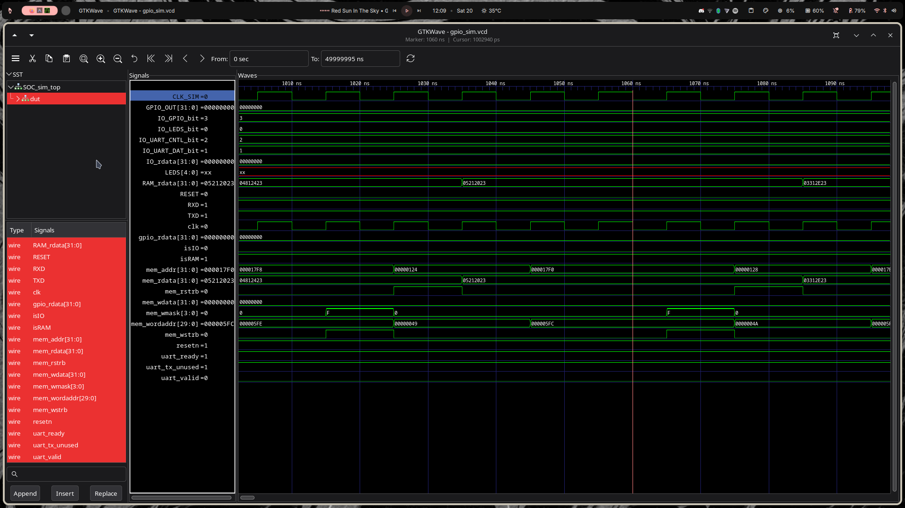

---

### Key Learnings

> **IO Address Decode (1-hot scheme):** The SoC does NOT use sequential byte offsets for IO. Peripheral bit `N` in the `localparam` corresponds to bit `N` of `mem_wordaddr = mem_addr[31:2]`. The actual byte address is `0x400000 | (1 << (N+2))`. Using the wrong address silently triggers multiple peripherals simultaneously.

> **Simulation vs Hardware:** The iCE40 `SB_HFOSC` oscillator and `Clockworks` gearbox are hardware-only primitives. For simulation, a `CLK_SIM` port is conditionally added to SOC under `ifdef SIM`.

> **Hex Format for `$readmemh`:** `objcopy -O verilog` produces byte-addressed Intel hex, which does not directly load into a `reg [31:0]` array. The correct format is one 32-bit little-endian word per line — generated by the `bin2hex.py` helper script.

---

## Task 5: Design a Multi-Register GPIO IP with Software Control

**Objective:** Extend the simple 32-bit GPIO register from Task 4 into a multi-register, software-controlled GPIO peripheral. This includes designing a proper register map, implementing individual bit direction control (input vs. output mode), updating the SoC bus address decoding, writing bare-metal C test code, and validating functionality via Icarus Verilog simulation and GTKWave.

---

### Step 1 — Register Map Design

The multi-register GPIO peripheral is mapped to base address **`0x400100`** in the SoC memory map. Address offsets within the peripheral are decoded using `mem_addr[3:2]`:

| Offset | Register Name | Access | Description |
|---|---|---|---|
| `0x00` | `GPIO_DATA` | R/W | GPIO output data register |
| `0x04` | `GPIO_DIR` | R/W | Direction register (1 = output, 0 = input) |
| `0x08` | `GPIO_READ` | R | Readback register |

#### How Address Offsets are Decoded
In `riscv.v`, the GPIO_CTRL peripheral is selected when the CPU accesses the IO page (`isIO = 1`) and address bit 8 is high (`mem_addr[8] = 1`), mapping the block to `0x400100`. Inside `GPIO_CTRL.v`, register offsets are decoded using `mem_addr[3:2]` (which corresponds to word-aligned offsets: `0x00` is `2'b00`, `0x04` is `2'b01`, and `0x08` is `2'b10`).

---

### Step 2 — Implement Multi-Register RTL (`GPIO_CTRL.v`)

A new module `GPIO_CTRL` was created to implement direction-masking and readback logic:

```verilog
module GPIO_CTRL (
    input             clk,        // system clock
    input             resetn,     // active-low synchronous reset
    input             sel,        // block select: asserted when this IP is addressed
    input      [1:0]  reg_sel,    // register select: mem_addr[3:2]
    input             wstrb,      // write strobe: |mem_wmask
    input      [31:0] wdata,      // write data from CPU
    output reg [31:0] rdata,      // read data to IO_rdata mux
    input      [31:0] gpio_in,    // GPIO input pin values (or loopback)
    output     [31:0] gpio_out,   // GPIO output values (direction-masked)
    output     [31:0] gpio_dir    // direction register (1=output, 0=input)
);
    localparam REG_DATA = 2'b00;  // 0x00
    localparam REG_DIR  = 2'b01;  // 0x04
    localparam REG_READ = 2'b10;  // 0x08

    reg [31:0] gpio_data_reg;
    reg [31:0] gpio_dir_reg;

    // Synchronous write
    always @(posedge clk) begin
        if (!resetn) begin
            gpio_data_reg <= 32'b0;
            gpio_dir_reg  <= 32'b0; // all inputs by default
        end else if (sel & wstrb) begin
            case (reg_sel)
                REG_DATA: gpio_data_reg <= wdata;
                REG_DIR:  gpio_dir_reg  <= wdata;
                default:  ;
            endcase
        end
    end

    // Mask output pins by direction
    assign gpio_out = gpio_data_reg & gpio_dir_reg;
    assign gpio_dir = gpio_dir_reg;

    // Combinational readback
    always @(*) begin
        case (reg_sel)
            REG_DATA: rdata = gpio_data_reg;
            REG_DIR:  rdata = gpio_dir_reg;
            REG_READ: rdata = (gpio_dir_reg & gpio_data_reg) | (~gpio_dir_reg & gpio_in);
            default:  rdata = 32'b0;
        endcase
    end
endmodule
```

#### How Direction Affects Behavior
- **Outputs (`GPIO_DIR = 1`):** The output driver drives the value from `GPIO_DATA` to the pin. `GPIO_READ` returns the driven output value.
- **Inputs (`GPIO_DIR = 0`):** The output driver is disabled (high-impedance, reading `0` in simulation loopback). `GPIO_READ` returns the external state from the `gpio_in` pin.

---

### Step 3 — Integrate into the SoC (`riscv.v`)

`GPIO_CTRL` was integrated by mapping it to a separate address space (`0x400100` via `mem_addr[8]`), routing it into `IO_rdata`, and exposing outputs:

```verilog
wire isGPIOCTRL = isIO & mem_addr[8];
wire [31:0] gpioctrl_rdata;
wire [31:0] gpioctrl_out_w;

GPIO_CTRL gpio_ctrl (
   .clk     (clk),
   .resetn  (resetn),
   .sel     (isGPIOCTRL),
   .reg_sel (mem_addr[3:2]),
   .wstrb   (mem_wstrb),
   .wdata   (mem_wdata),
   .rdata   (gpioctrl_rdata),
   .gpio_in (gpioctrl_out_w),  // loopback in simulation
   .gpio_out(gpioctrl_out_w),
   .gpio_dir(GPIOCTRL_DIR)
);
assign GPIOCTRL_OUT = gpioctrl_out_w;
```

---

### Step 4 — Software Validation

A bare-metal C program (`firmware/gpio_ctrl_test.c`) was written to run four test scenarios verifying input, output, mixed direction, and register readback:

```c
#define GPIO_DATA  (*(volatile uint32_t*)(0x400100))
#define GPIO_DIR   (*(volatile uint32_t*)(0x400104))
#define GPIO_READ  (*(volatile uint32_t*)(0x400108))

int main(void) {
    // 1. All outputs: write DATA, read GPIO_READ
    GPIO_DIR  = 0xFFFFFFFFu;
    GPIO_DATA = 0xDEADBEEFu;
    print_result("GPIO_READ (all out)", GPIO_READ, 0xDEADBEEFu);

    // 2. All inputs: write DATA, read GPIO_READ -> should be 0 (loopback)
    GPIO_DIR  = 0x00000000u;
    GPIO_DATA = 0xA5A5A5A5u;
    print_result("GPIO_READ (all in) ", GPIO_READ, 0x00000000u);

    // 3. Mixed dir: lower 16 out, upper 16 in
    GPIO_DIR  = 0x0000FFFFu;
    GPIO_DATA = 0x12345678u;
    print_result("GPIO_READ (mixed)  ", GPIO_READ, 0x00005678u);

    // 4. DIR register readback
    GPIO_DIR = 0xCAFEBABEu;
    print_result("GPIO_DIR readback  ", GPIO_DIR, 0xCAFEBABEu);
}
```

---

### Step 5 — Simulation Verification

The testbench compiles the `gpio_ctrl_test.c` firmware, loads it into instruction memory, and simulates using `iverilog`:

```bash
# Compile and run
iverilog -DBENCH -DSIM -g2012 -o SOC_sim.vvp SOC_sim_top.v riscv.v
vvp SOC_sim.vvp
```

**Simulation Output:**
```
=== GPIO_CTRL Multi-Register Test ===

[Test 1] All Outputs (DIR=0xFFFFFFFF)
  GPIO_DATA readback: 0xDEADBEEF  [ PASS ]
  GPIO_READ (all out): 0xDEADBEEF  [ PASS ]

[Test 2] All Inputs (DIR=0x00000000)
  GPIO_READ (all in) : 0x00000000  [ PASS ]

[Test 3] Mixed Dir (DIR=0x0000FFFF, lower=out, upper=in)
  GPIO_READ (mixed)  : 0x00005678  [ PASS ]

[Test 4] DIR Register Readback
  GPIO_DIR readback  : 0xCAFEBABE  [ PASS ]

------------------------------
Results: 5/5 passed
```

> **GTKWave Waveform Screenshot:**

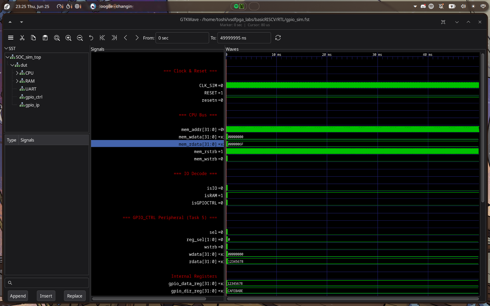

---

## Task 6: Programmable Countdown Timer IP

**Objective:** Design a memory-mapped countdown timer IP and integrate it into the basicRISCV SoC. The timer supports configurable countdown with one-shot and periodic (auto-reload) modes, a programmable prescaler for long timeouts, and a write-1-to-clear timeout status flag. Software running on the RISC-V core validates all modes via UART output, and the timeout event toggles an LED for observable hardware behaviour.

---

### Step 1 — Register Map Design

The Timer peripheral is mapped to base address **`0x400200`** in the SoC memory map. The block is selected when `isIO = 1` and `mem_addr[9] = 1`. Register offsets are decoded by `mem_addr[3:2]`:

| Offset | Register | R/W | Description |
|--------|----------|-----|-------------|
| `0x00` | CTRL     | R/W | Control register |
| `0x04` | LOAD     | R/W | Countdown start value |
| `0x08` | VALUE    | R   | Current countdown value (read-only) |
| `0x0C` | STATUS   | R/W | Timeout status (write-1-to-clear) |

#### CTRL Register Bit Fields

| Bits   | Field     | Description |
|--------|-----------|-------------|
| [0]    | EN        | 1 = enable counting, 0 = freeze |
| [1]    | MODE      | 0 = one-shot (stops at 0), 1 = periodic (auto-reload) |
| [2]    | PRESC_EN  | 1 = enable prescaler |
| [15:8] | PRESC_DIV | Prescaler value; timer decrements every (PRESC_DIV+1) clocks |

---

### Step 2 — Implement Timer RTL (`TIMER.v`)

Key design elements of the synchronous Verilog implementation:

```verilog
module TIMER (
    input             clk,
    input             resetn,
    input             sel,
    input      [1:0]  reg_sel,    // mem_addr[3:2]
    input             wstrb,
    input      [31:0] wdata,
    output reg [31:0] rdata,
    output            timeout_irq
);
    localparam REG_CTRL   = 2'b00;
    localparam REG_LOAD   = 2'b01;
    localparam REG_VALUE  = 2'b10;
    localparam REG_STATUS = 2'b11;

    // Prescaler tick
    assign tick = ctrl_presc_en ? (presc_cnt == 8'd0) : 1'b1;

    // On timeout:
    //   One-shot  → clear EN (timer stops)
    //   Periodic  → reload VALUE from LOAD
    always @(posedge clk) begin
        if (value_reg == 32'd1 && ctrl_en && tick) begin
            value_reg      <= 32'd0;
            status_timeout <= 1'b1;
            if (!ctrl_mode) ctrl_en <= 1'b0;   // one-shot stop
        end
    end

    // Write-1-to-clear STATUS
    // VALUE is read-only (writes ignored)
    assign timeout_irq = status_timeout;
endmodule
```

#### Design Decisions
- **VALUE loads only on EN rising edge**: prevents accidental reloads when only MODE/PRESC bits change.
- **One-shot auto-stops**: `ctrl_en` is cleared in hardware on timeout — no software stop needed.
- **Prescaler initialises to PRESC_DIV**: first tick fires after exactly (PRESC_DIV+1) clocks.

---

### Step 3 — Integrate into the SoC (`riscv.v`)

```verilog
wire isTimer = isIO & mem_addr[9];   // 0x400200
wire [31:0] timer_rdata;

TIMER timer_ip (
   .clk        (clk),
   .resetn     (resetn),
   .sel        (isTimer),
   .reg_sel    (mem_addr[3:2]),
   .wstrb      (mem_wstrb),
   .wdata      (mem_wdata),
   .rdata      (timer_rdata),
   .timeout_irq(TIMER_TIMEOUT)
);

// Extended IO_rdata mux
wire [31:0] IO_rdata =
    mem_wordaddr[IO_UART_CNTL_bit] ? {22'b0, !uart_ready, 9'b0} :
    mem_wordaddr[IO_GPIO_bit]      ? gpio_rdata    :
    isGPIOCTRL                     ? gpioctrl_rdata:
    isTimer                        ? timer_rdata   :
                                     32'b0;
```

---

### Step 4 — Software Validation (`timer_test.c`)

```c
#define TIMER_BASE    0x400200u
#define TIMER_CTRL    (*(volatile uint32_t*)(TIMER_BASE + 0x00))
#define TIMER_LOAD    (*(volatile uint32_t*)(TIMER_BASE + 0x04))
#define TIMER_VALUE   (*(volatile uint32_t*)(TIMER_BASE + 0x08))
#define TIMER_STATUS  (*(volatile uint32_t*)(TIMER_BASE + 0x0C))

// One-shot
TIMER_LOAD   = 10u;
TIMER_STATUS = STATUS_TIMEOUT;        // clear stale
TIMER_CTRL   = CTRL_EN;              // enable, MODE=0
while (!(TIMER_STATUS & STATUS_TIMEOUT));
TIMER_STATUS = STATUS_TIMEOUT;        // clear

// Periodic — toggle LED on each timeout
TIMER_LOAD = 8u;
TIMER_CTRL = CTRL_EN | CTRL_PERIODIC;
for (int i = 0; i < 3; i++) {
    while (!(TIMER_STATUS & STATUS_TIMEOUT));
    TIMER_STATUS = STATUS_TIMEOUT;
    LEDS = (uint32_t)(i & 1u);        // toggle
}

// Prescaler (divide by 3)
TIMER_LOAD = 4u;
TIMER_CTRL = CTRL_EN | CTRL_PRESC_EN | CTRL_PRESC(2);
```

---

### Step 5 — Simulation Verification

```bash
cd RTL/firmware && make          # compiles timer_test.c → firmware.hex
cd RTL
iverilog -DBENCH -DSIM -g2012 -o SOC_sim.vvp SOC_sim_top.v riscv.v
vvp SOC_sim.vvp
```

**Simulation Output:**
```
=== TIMER IP Test (Task 6) ===

[Test 1] One-shot mode (LOAD=10)
  VALUE after timeout: 0x00000000
  VALUE == 0  [ PASS ]
  STATUS.TIMEOUT set  [ PASS ]
  STATUS.TIMEOUT cleared  [ PASS ]

[Test 2] Periodic mode (LOAD=8, 3 timeouts)
  3 periodic timeouts received  [ PASS ]

[Test 3] Prescaler mode (LOAD=4, PRESC_DIV=2)
  VALUE == 0 after prescaled count  [ PASS ]
  TIMEOUT set in prescaler mode  [ PASS ]

[Test 4] VALUE decrements (LOAD=100)
  VALUE mid-count: 0x00000059
  VALUE < LOAD while counting  [ PASS ]

------------------------------
Results: 7/7 passed
```

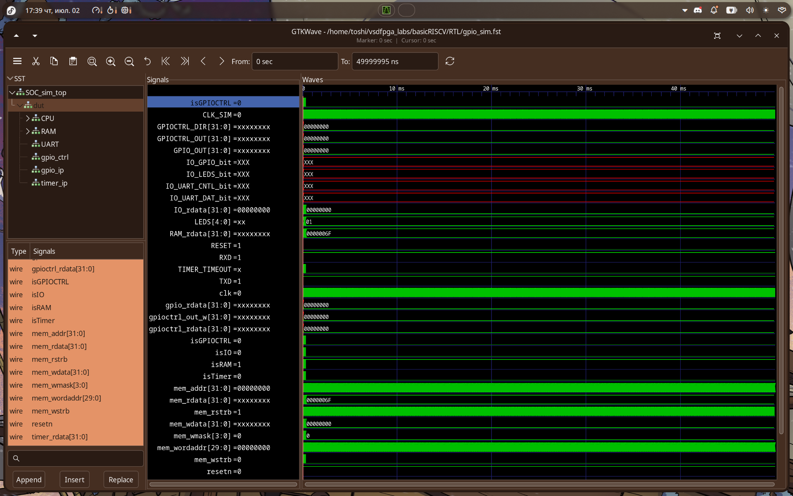

---

---

## Task 7: Commercial-Grade IP Documentation & Release

**Objective:** Package the Timer IP exactly like a commercial FPGA IP, so any user with a VSDSquadron FPGA board can integrate and use it without reading the RTL. The documentation assumes the reader did not write this IP.

---

### Deliverable Structure

```
ip/timer/
├── rtl/
│   └── TIMER.v                ← Single drop-in RTL file, no dependencies
├── software/
│   └── timer_test.c           ← 7/7 validation firmware + usage examples
├── docs/
│   ├── IP_User_Guide.md       ← Features, block diagram, modes, limitations
│   ├── Register_Map.md        ← Full bit-level register reference
│   ├── Integration_Guide.md   ← Step-by-step riscv.v integration + FPGA pins
│   └── Example_Usage.md       ← 5 ready-to-run C code examples
└── README.md                  ← 30-second overview and quick start
```

---

### IP Overview

The **TIMER IP** is a programmable 32-bit countdown timer for the basicRISCV SoC. It is memory-mapped at base address `0x400200` and controlled entirely by software on the RISC-V core.

**Typical use cases:**
- Software delays (busy-wait for N clock cycles)
- Periodic events (LED blink, scheduled task triggers)
- Timeout detection in protocol handlers

---

### Feature Summary

| Feature | Details |
|---------|--------|
| Counter width | 32-bit countdown |
| Modes | One-shot (stops at 0), Periodic (auto-reload) |
| Prescaler | Optional ÷(PRESC_DIV+1), 8-bit divisor (max ÷256) |
| Bus interface | 32-bit memory-mapped, word-aligned |
| Interrupt support | **None** — polling only |
| Observable output | `TIMER_TIMEOUT` port (routes to LED or header pin) |
| Reset | Synchronous, active-low |

---

### Register Map

**Base address: `0x400200`** — decoded as `isIO & mem_addr[9]`

| Offset | Address | Register | R/W | Description |
|--------|---------|----------|-----|-------------|
| `0x00` | `0x400200` | CTRL | R/W | `[0]`=EN, `[1]`=MODE, `[2]`=PRESC_EN, `[15:8]`=PRESC_DIV |
| `0x04` | `0x400204` | LOAD | R/W | 32-bit countdown start value |
| `0x08` | `0x400208` | VALUE | R | Current countdown (read-only, writes ignored) |
| `0x0C` | `0x40020C` | STATUS | R/W | `[0]`=TIMEOUT (write-1-to-clear) |

---

### Software Programming Model

#### Initialization sequence
```c
TIMER_CTRL   = 0;                  // 1. Disable (safe start)
TIMER_LOAD   = <count_value>;      // 2. Set load value
TIMER_STATUS = 1;                  // 3. Clear stale TIMEOUT flag
TIMER_CTRL   = CTRL_EN;           // 4. Enable (VALUE loads from LOAD here)
```

#### Polling sequence
```c
while (!(TIMER_STATUS & 1));       // Poll TIMEOUT bit
TIMER_STATUS = 1;                  // Write-1-to-clear
```

#### 30-second quick start
```c
// Wait 1000 clock cycles, then continue
TIMER_LOAD = 1000; TIMER_STATUS = 1; TIMER_CTRL = 0x01;
while (!(TIMER_STATUS & 1)); TIMER_STATUS = 1;
```

---

### Integration Summary

Only 4 changes needed in `riscv.v`:

1. `` `include "TIMER.v" `` — at top of file
2. `output TIMER_TIMEOUT` — added to SOC module ports
3. `wire isTimer = isIO & mem_addr[9]` — block-select decode
4. Instantiate `TIMER timer_ip(...)` and extend `IO_rdata` mux

See [`ip/timer/docs/Integration_Guide.md`](../vsdfpga_labs/basicRISCV/RTL/ip/timer/docs/Integration_Guide.md) for the exact line-by-line diff.

---

### Board-Level Usage (VSDSquadron FPGA)

`TIMER_TIMEOUT` is exposed as a top-level SoC output. Connect it to a VSDSquadron LED in your top-level Verilog:

```verilog
assign LED0 = TIMER_TIMEOUT;
```

In periodic mode, the LED reflects the TIMEOUT flag state — stays high between timeout and software clear. For a clean toggle, the firmware clears the flag on each event (demonstrated in `timer_test.c`).

---

### Documentation Highlights

| Document | Key content |
|----------|------------|
| `IP_User_Guide.md` | Block diagram (ASCII), timing diagram, prescaler table, mode descriptions |
| `Register_Map.md` | Bit-field diagrams for all 4 registers, reset values, write-1-to-clear rules |
| `Integration_Guide.md` | Exact `riscv.v` edits, full IO address map, FPGA pin routing, `.pcf` notes |
| `Example_Usage.md` | 5 examples: delay, LED blink, prescaler, cycle measurement, periodic counter |

---

## Repository Structure

```
VSD-internship/
├── images/
│   ├── task1/          # Screenshots for Task 1
│   │   ├── a.png       # Toolchain binaries
│   │   ├── b.png       # GCC host compilation output
│   │   ├── c.png       # RISC-V -O1 disassembly
│   │   ├── d.png       # RISC-V -Ofast disassembly (part 1)
│   │   └── e.png       # RISC-V -Ofast disassembly (part 2)
│   ├── task2/          # Screenshots for Task 2
│   │   ├── a.png       # GCC and RISC-V toolchain compilation output (Part A)
│   │   ├── b.png       # Object dump of sum1ton.o (Part A)
│   │   ├── c.png       # Spike debugger session (Part A)
│   │   ├── d.png       # GCC and RISC-V toolchain compilation output (Part B)
│   │   ├── e.png       # Object dump of fibonacci.o (Part B)
│   │   └── f.png       # Spike debugger session for fibonacci.o (Part B)
│   ├── task3/          # Screenshots for Task 3
│   │   ├── a.png       # Tool verification in VSD Codespace
│   │   ├── b.png       # Compiling and running sum1ton in the Codespace
│   │   ├── c.png       # Running the FPGA+RISC-V setup script
│   │   ├── d.png       # Toolchain extraction and bram hex build
│   │   ├── e.png       # Building riscv_logo.bram.hex
│   │   ├── f.png       # Spike simulation VSD ASCII art output
│   │   ├── g.png       # Installing dependencies on local Fedora
│   │   └── h.png       # Local Fedora toolchain verification
│   ├── task4/          # Screenshots for Task 4
│   │   └── a.png       # GTKWave simulation screenshot
│   ├── task5/          # Screenshots for Task 5
│   │   └── a.png       # GTKWave simulation screenshot
│   └── task6/          # Screenshots for Task 6
│       └── a.png       # GTKWave Timer IP waveform screenshot
└── README.md
```

> **RTL + IP sources** live in the `basicRISCV` repository under `RTL/`. The `ip/timer/` folder contains the full commercial-grade IP package.

---

## Acknowledgements

- [VLSI System Design (VSD)](https://www.vlsisystemdesign.com/) — for the internship program and curriculum
- [RISC-V GNU Toolchain](https://github.com/riscv-collab/riscv-gnu-toolchain) — the open-source cross-compilation toolchain used throughout
- [SiFive](https://www.sifive.com/) — for the pre-built RISC-V GCC 8.3.0 toolchain distribution
- [Icarus Verilog](http://iverilog.icarus.com/) — open-source Verilog simulator used for GPIO32 verification
- [GTKWave](http://gtkwave.sourceforge.net/) — waveform viewer for post-simulation analysis
